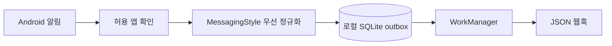

# Herald

Herald는 Android 알림을 작은 표준 메시지 이벤트로 바꿔 로컬에서 확인하거나 웹훅으로 전달하는 네이티브 앱입니다. 카카오톡(`com.kakao.talk`)을 기본 대상으로 삼지만, 정확한 패키지명만 추가하면 다른 메신저도 같은 파이프라인으로 처리할 수 있습니다.

이름은 알림을 받아 필요한 곳으로 전하는 **전령(herald)** 에서 가져왔습니다.

> 현재 단계: `0.1.0` MVP. 실기기 카카오톡 알림 형태에 대한 fixture 검증이 더 필요합니다.

## 왜 이렇게 만들었나

범용 봇 런타임, 접근성 서비스, JavaScript 엔진, 자동 답장을 한 앱에 묶지 않았습니다. Herald는 아래 한 가지 흐름만 안정적으로 담당합니다.



- `NotificationListenerService`만 사용하며 접근성 권한은 요구하지 않습니다.
- `MessagingStyle` 구조를 먼저 읽고, 없을 때만 `text → bigText → textLines` 순서로 보완합니다.
- 알림 업데이트에 과거 메시지가 다시 포함되어도 안정적인 이벤트 ID와 DB 기본키로 중복을 억제합니다.
- 저장 후 전달하므로 네트워크가 잠시 끊겨도 WorkManager가 재시도합니다.
- 웹훅을 비워 두면 기기 안에서 파서 결과만 확인할 수 있습니다.

## 사용하기

요구 사항은 Android 8.0(API 26) 이상입니다.

1. Debug APK를 설치하고 Herald를 엽니다.
2. **권한 연결**을 눌러 Android의 알림 접근 설정에서 Herald를 허용합니다.
3. 기본 allowlist인 `com.kakao.talk`을 그대로 쓰거나 패키지명을 한 줄에 하나씩 추가합니다.
4. 필요하면 HTTPS 웹훅과 Bearer token을 입력합니다. 웹훅을 비워 두면 로컬 전용으로 동작합니다.
5. 메시지를 받은 뒤 **최근 수집**에서 파싱 결과와 전달 상태를 확인합니다.

```bash
./gradlew testDebugUnitTest lintDebug assembleDebug
adb install -r app/build/outputs/apk/debug/app-debug.apk
```

## 웹훅 계약

Herald는 메시지마다 `POST` 요청을 보냅니다. 본문과 `Idempotency-Key` 헤더에 같은 안정 ID가 들어갑니다.

```json
{
  "schemaVersion": 1,
  "type": "message.received",
  "id": "7ebf...",
  "capturedAt": 1786525200123,
  "source": {
    "package": "com.kakao.talk",
    "label": "카카오톡",
    "notificationKey": "0|com.kakao.talk|...",
    "conversationId": "optional-shortcut-id"
  },
  "message": {
    "conversation": "가족방",
    "sender": "민지",
    "text": "저녁 7시에 봐",
    "sentAt": 1786525199000,
    "isGroupConversation": true,
    "hasAttachment": false,
    "attachmentMimeType": null
  },
  "extractionMethod": "messaging_style",
  "contentTruncated": false
}
```

수신 서버는 ID를 저장해 같은 요청을 여러 번 받아도 한 번만 처리해야 합니다. HTTP `2xx`는 성공, `408`·`425`·`429`·`5xx`는 재시도, 나머지 상태는 확인이 필요한 실패로 처리합니다. 리다이렉트는 인증정보 유출을 막기 위해 따라가지 않습니다. 자세한 내용은 [웹훅 계약](docs/WEBHOOK.md)을 참고하세요.

## 중복 제거 의미

Android의 알림 콜백은 생성뿐 아니라 갱신에도 호출됩니다. 메신저는 `[A]` 알림을 `[A, B]`로 다시 게시할 수 있기 때문에 알림 키만 비교하거나 콜백마다 전체 목록을 보내면 메시지를 잃거나 중복 전송하게 됩니다.

Herald는 구조화된 메시지에 대해 `앱 + 대화 ID(없으면 알림 키) + 발신자 + 본문 + 메시지 시각 + 동일 항목 순번`으로 이벤트 ID를 만듭니다. 따라서 `[A] → [A, B]`에서는 B만 새 이벤트가 됩니다. 단, 발신자·본문이 같고 메시지 시각도 없는 두 알림이 별도 스냅샷으로 연속 도착하면 둘을 완전히 구분할 정보가 없습니다. 이 경우 Herald는 중복 방지를 우선합니다.

처음 관찰한 `MessagingStyle` 알림에 이미 최근 대화가 들어 있다면 그 안의 항목이 각각 한 번 기록될 수 있습니다. 현재 활성 알림을 임의로 역수집하지는 않습니다.

## 개인정보와 보안

- allowlist를 통과하기 전에는 알림 extras를 읽지 않습니다.
- 원본 `Bundle`, `RemoteViews`, 첨부 URI는 저장하거나 열지 않습니다.
- 웹훅 주소와 Bearer token은 하나의 라우팅 설정으로 묶어 Android Keystore의 AES-GCM 키로 암호화합니다.
- HTTPS를 기본으로 강제합니다. 명시적으로 켠 경우에만 localhost 또는 숫자로 쓴 사설 IP의 HTTP를 허용하며, HTTP에서는 Bearer token을 사용할 수 없습니다.
- 앱 백업과 기기 전송에서 DB·설정을 제외합니다.
- 전달에 성공하면 대화명, 발신자, 본문, MIME type을 즉시 DB에서 지웁니다.
- 전달 대기 중인 outbox는 자동 삭제하지 않습니다. 전달 대기가 아닌 기록은 최대 500건, 7일까지만 보관하며 화면에서 모두 삭제할 수 있습니다.
- 메시지 화면은 Android 보안 플래그로 스크린샷과 최근 앱 미리보기를 차단합니다.
- 메시지 본문이나 토큰을 로그에 남기지 않습니다.

## 플랫폼 한계

- 알림 미리보기를 메신저에서 숨기면 Herald도 숨겨진 내용을 복구할 수 없습니다.
- Android 15 이상은 신뢰되지 않은 알림 리스너에서 감지된 OTP 내용을 가릴 수 있습니다.
- Work profile 알림, force-stop, 일부 제조사의 강한 절전 정책에서는 수집 공백이 생길 수 있습니다.
- 알림 접근 권한이 허용된 상태와 Android가 리스너를 실제 연결한 상태는 다를 수 있어 화면에 둘을 구분해 표시합니다.
- Herald는 자동 답장이나 카카오톡 내부 데이터베이스 접근을 제공하지 않습니다.

관련 Android 문서: [NotificationListenerService](https://developer.android.com/reference/android/service/notification/NotificationListenerService), [MessagingStyle 추출](https://developer.android.com/reference/androidx/core/app/NotificationCompat.MessagingStyle#extractMessagingStyleFromNotification(android.app.Notification)), [WorkManager](https://developer.android.com/develop/background-work/background-tasks/persistent), [Android 15 OTP 보호](https://developer.android.com/about/versions/15/behavior-changes-all#otp-redaction).

## 프로젝트 구조

```text
app/src/main/java/dev/imian/herald/
├── data/          SQLite history + durable outbox
├── delivery/      WorkManager scheduling + webhook client
├── notification/  Android listener + bounded framework adapter
├── parser/        Android와 분리된 순수 Kotlin parser
├── settings/      allowlist, URL validation, encrypted routing
├── status/        listener runtime diagnostics
└── ui/            Jetpack Compose control panel
```

Room이나 DI 프레임워크 없이 단일 앱 모듈과 수동 의존성 조립을 사용합니다. 초기 앱의 데이터 흐름이 작은 만큼 빌드 복잡도를 낮추고, 파서는 Android 프레임워크에서 분리해 단위 테스트합니다.

## 검증

```bash
./gradlew testDebugUnitTest
./gradlew connectedDebugAndroidTest  # emulator 또는 실기기 필요
./gradlew lintDebug assembleDebug
```

실제 지원 범위를 선언하기 전에는 Pixel과 Samsung 기기에서 개인/그룹/오픈 채팅, 사진·스티커, 음소거 채팅, 미리보기 숨김 상태의 sanitized fixture를 확인해야 합니다.

## License

[MIT](LICENSE)
